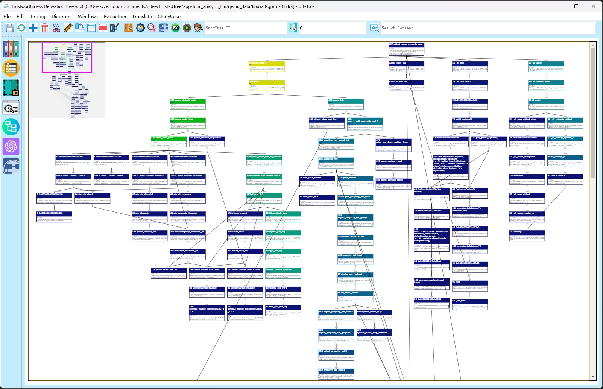
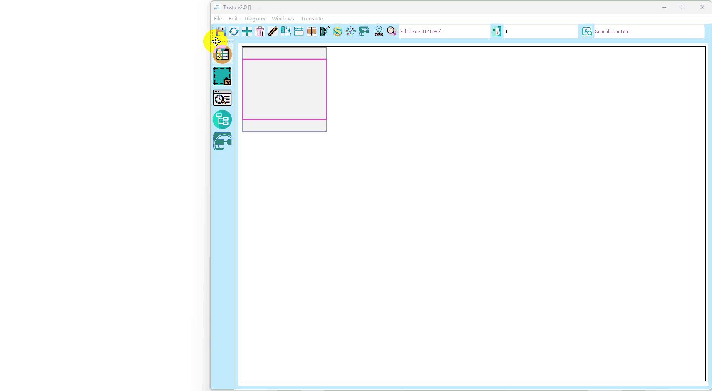

# Trusta: Enhancing Large-Scale Code Understanding with GSN and LLMs

Trusta is a tool designed to transform complex codebases into structured Goal Structuring Notation ([GSN](https://scsc.uk/gsn?page=gsn%202standard)) diagrams, facilitating improved understanding and maintenance of large-scale software projects. This tool leverages the power of large language models (LLMs) to generate natural language descriptions of code, enhancing communication and comprehension among programmers.

## Overview

Trusta addresses key challenges in software maintenance, such as the complexity of code, inadequate documentation, and communication barriers within teams. By generating GSN diagrams, Trusta provides a visual representation of the software's architecture and logic, allowing stakeholders to grasp the overall structure and specific functionalities more effectively.



## Features

- **Automated GSN Generation**: Convert large codebases into GSN diagrams that outline goals, strategies, sub-goals, and evidences, providing a clear overview of the software's logic.
- **Function Call Graphs**: Visualize the relationships and dependencies between functions within the code, focusing on the core functionality through node filtration.
- **LLM Integration**: Utilize large language models to translate code into natural language, offering concise explanations of functions and their strategic uses.

## How It Works

1. **Function Call Graph Generation**: Trusta generates dynamic function call graphs to represent the software's functional structure. This step focuses on capturing relevant code portions, reducing the complexity faced by programmers.

2. **Function Node Filtration**: Irrelevant nodes are pruned from the function call graph, simplifying the visualization and highlighting essential code components.

3. **Natural Language Transformation**: Using LLMs, Trusta analyzes the code and produces natural language descriptions of each function's purpose and strategic use of external functions.

4. **GSN Framework Construction**: Constructs a comprehensive GSN diagram, integrating goals, sub-goals, strategies, evidences, contexts, assumptions, and justifications.

5. **Visualization**: Presents the GSN diagram through an interactive interface, allowing users to navigate and explore the software's structure.


## Benefits

- **Improved Understanding**: Provides a structured overview of the software, reducing the cognitive load on developers and aiding in the comprehension of complex codebases.
- **Enhanced Communication**: Bridges the gap between technical and non-technical stakeholders by translating code into accessible language.
- **Increased Confidence**: Empowers programmers to confidently make modifications and improvements to the code, supported by clear and reliable documentation.

## Getting Started

To facilitate testing, we have provided a sample program in `resource/demo_project`.
To get started with Trusta, follow these steps:

1. Clone the repository:
   ```shell
   git clone https://github.com/AssuranceCase/Trusta.git
   ```

2. Install dependencies:
   Install [Graphviz 12.0.0](https://graphviz.org/download/) and [Python 3.8.5](https://www.python.org/downloads/release/python-385/), and then install the Python dependencies:
   ```shell
   pip install -r requirements.txt
   ```

3. Deploy the large language model (see Appendix 1). (If only running the demo program, this step can be skipped.)

4. Edit the configuration file (see Appendix 2). (Optional step)

5. Run the tool: On Windows, double-click the `run.bat` file.

6. Use the `File`-`Python Code Import` function from the menu bar to execute Python code and generate the GSN in the main interface.

   - Note: For other programming languages, such as C++ and Java, you can import the function call graph via `File`-`Dot Import` and then proceed with the subsequent steps (see Appendix 3).

7. Explore the GSN visualization in the interactive interface.



## Appendix 1: Deploying the Large Language Model

For the demo program, the inference results of the large model have been cached into a file, so you can run it without deploying the model. If you need to run other Python programs, please follow the steps below to deploy the large language model.

**Reference Environment**: A server with 4 NVIDIA GeForce RTX 3090 GPUs, operating system Ubuntu 22.04 LTS.

Deploy using Docker commands:
```shell
docker run -d --gpus=all -v ollama:/root/.ollama -p 11434:11434 --name ollama ollama/ollama

docker exec -it ollama ollama run llama3:70b
```

Configure the model access path in `app/config.json` under `"LLM_INFO"->"llama3:70b"->"url"`.

## Appendix 2: Editing the Configuration File
Configuration File Path: `app/config.json`
Example configuration:
```json
{
    "LLM_USE": "llama3:70b",
    "LLM_INFO": {
        "llama3:70b": {
            "model": "llama3:70b",
            "url": "http://127.0.0.1:11434/api/chat"
        },
        "llama3.1:8b": {
            "model": "llama3.1:8b",
            "url": "http://127.0.0.1:11434/api/chat"
        }
    },
    "PROJECT_START_FILE": "../resource/demo_project/main.py",
    "FUNCTION_CODE_PATH": "",
    "TESTCASE_CODE_PATH": "",
    "FUNCTION_NEED_KEYWORDS": [],
    "FUNCTION_IGNORE_KEYWORDS": [
        "pydevd",
        "__main__"
    ]
}
```

### Description of Fields:
- **LLM_INFO**: Information about available large language models.
- **LLM_USE**: Sets the current large language model to use (configured in LLM_INFO).
- **PROJECT_START_FILE**: The entry file for the target Python program.
- **FUNCTION_CODE_PATH**: Intermediate file to save function code during execution.
- **TESTCASE_CODE_PATH**: Intermediate file to save test case code during execution.
- **FUNCTION_NEED_KEYWORDS**: Keywords for step (2) function node filtration, representing functions that require attention.
- **FUNCTION_IGNORE_KEYWORDS**: Keywords for step (2) function node filtration, representing functions that can be ignored.

## Appendix 3: Importing Function Call Graph via Dot File

Function call graphs (`.dot` files) can be generated for various programming languages. For example, Python can use the [pycallgraph](https://pypi.org/project/pycallgraph/) library, C++ can use the [callgrind](https://valgrind.org/docs/manual/cl-manual.html) tool, and Java can use the [java-callgraph](https://github.com/Adrninistrator/java-all-call-graph) tool.

To facilitate testing, we have provided the `.dot` files and other necessary resources for the [QEMU project](https://gitlab.com/qemu-project/qemu) in `resource/qemu_project`.

Follow these steps to generate the GSN:

1. Import the `.dot` file into Trusta via `File`-`Dot Import`.

2. Create a file (either manually or using a tool) corresponding to **FUNCTION_CODE_PATH** in the configuration file. This file should map function names to their source code, formatted as follows:
   ```json
   {
       "function_name": "function body"
   }
   ```

3. In the main interface, set the subtree to operate on in the 'Sub-Tree ID:Level' text box.

4. Use `Edit`-`Prune Node` to trim the remaining tree nodes. (Optional step)

5. Generate the GSN via `Translate`-`Function Analyzer`.

